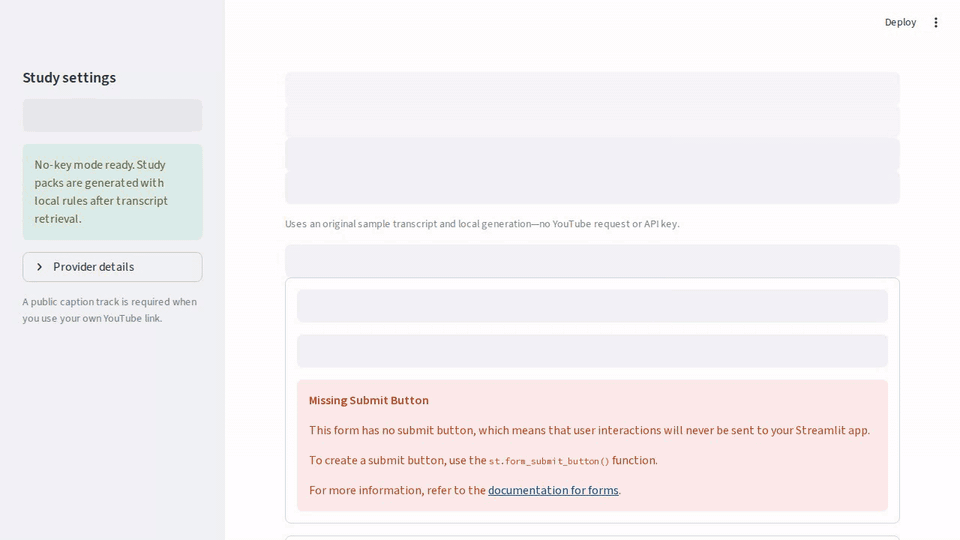
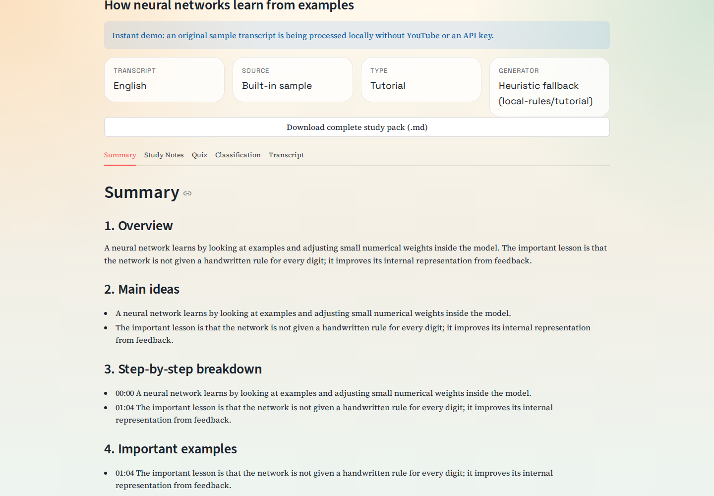
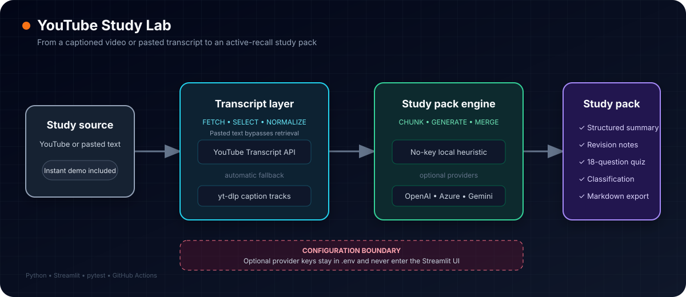

<div align="center">

# YouTube Study Lab

**Turn a captioned YouTube video—or pasted transcript—into a summary, revision notes, and an active-recall quiz.**

[](https://github.com/asadbek066/youtube-study-lab/actions/workflows/ci.yml)
[](https://www.python.org/)
[](https://streamlit.io/)
[](LICENSE)
[](https://yowassup.streamlit.app/)

**No API key required · Hosted-server fallback · 18-question quiz · Markdown export**

### [Open the live app →](https://yowassup.streamlit.app/)

</div>



## Try it in 30 seconds

Open the **[live app](https://yowassup.streamlit.app/)** and click **See a complete study pack instantly**. The built-in demo uses an original sample transcript and local generation, so it makes no YouTube or model-provider request.

To run it locally instead:

```bash
git clone https://github.com/asadbek066/youtube-study-lab.git
cd youtube-study-lab
python -m venv .venv
```

<details>
<summary><strong>Activate the virtual environment</strong></summary>

**Linux/macOS**

```bash
source .venv/bin/activate
```

**Windows PowerShell**

```powershell
.venv\Scripts\Activate.ps1
```

**Windows Command Prompt**

```bat
.venv\Scripts\activate.bat
```

</details>

```bash
python -m pip install --upgrade pip
python -m pip install --require-hashes -r requirements.lock
streamlit run app.py
```

`requirements.lock` is a hash-pinned runtime lock; pip verifies every artifact
before installing. Streamlit Community Cloud installs `requirements.txt`
directly, so hosted deployments resolve fresh transitive versions.

Open the local URL and use the same instant-demo flow.

## What you get



| Output | What it is useful for |
| --- | --- |
| **Structured summary** | A fast overview, main ideas, examples, takeaways, and timestamp links when the source is a video |
| **Study notes** | Revision-friendly concepts, terminology, examples, and review prompts |
| **18-question quiz** | Multiple-choice, short-answer, and application questions |
| **Classification** | Content type, confidence, and recommended summary/note styles |
| **Transcript** | The normalized caption text and source metadata |
| **Markdown export** | One portable file containing the complete study pack |

## Use your own video

1. Paste a YouTube URL or 11-character video ID.
2. Choose preferred caption languages in the sidebar.
3. Click **Build study pack**.
4. Review the five result tabs or download the complete Markdown pack.

The video must expose a public manual or automatic caption track. The app tries `youtube-transcript-api` first and then falls back to caption tracks discovered through `yt-dlp`.

If YouTube blocks transcript requests from your machine or hosting provider, open **YouTube blocked? Paste a transcript instead**, add an optional title, and paste transcript text. The same study-pack engine runs without a YouTube request, and the app does not invent timestamps for text-only sources.

## How it works



YouTube sources pass through language-aware transcript retrieval; pasted text goes directly to normalization. Long transcripts are split into bounded chunks. Each chunk is processed independently, then the results are merged and deduplicated into one study pack. Video sources retain timestamp links; pasted text does not receive fabricated timestamps.

## Generation modes

The default mode works without a model API key.

| Mode | Configuration | Notes |
| --- | --- | --- |
| **Local heuristic** | No setup required | Deterministic, private after transcript retrieval, and ideal for trying the app |
| **OpenAI** | `LLM_PROVIDER=openai` | Uses an OpenAI model configured through `.env` |
| **Azure OpenAI** | `LLM_PROVIDER=azure_openai` | Uses your Azure endpoint and deployment |
| **Gemini** | `LLM_PROVIDER=gemini` | Uses a Google Gemini model configured through `.env` |

To configure an API provider:

```bash
cp .env.example .env
```

On Windows PowerShell, use:

```powershell
Copy-Item .env.example .env
```

Then edit `.env` and set only the provider variables you need. API keys are loaded from the environment and are never entered in the Streamlit interface.

> **Privacy note:** In local heuristic mode, transcript processing stays in the app after retrieval. When an API provider is enabled, transcript chunks are sent to that provider under its terms and privacy policy.

## Configuration

Useful settings from `.env.example` include:

- `LLM_PROVIDER`: `heuristic`, `openai`, `azure_openai`, or `gemini`
- Provider model/deployment and API credentials
- `SUMMARY_STYLE` and `SUMMARY_DETAIL`
- Output-token limits for the configured provider
- `LLM_MAX_PROVIDER_CALLS_PER_HOUR`: process-wide provider-call budget shared
  by all sessions (default 120; read at startup)

The app validates numeric bounds and provider URLs, and automatically falls
back to local generation when a configured provider is unavailable. When that
happens the pack is labeled as locally generated and the interface says why.

## Development

Install the dependencies, then run:

```bash
python -m pip install --require-hashes -r requirements-dev.lock
python -m ruff check app.py youtube_study_tool tests
python -m ruff format --check app.py youtube_study_tool tests
python -m pytest tests -q
python -m compileall -q app.py youtube_study_tool tests
```

The GitHub Actions workflow runs lint, formatting, byte-compilation, dependency
consistency, and the test suite on Python 3.11 through 3.14 for pushes and pull
requests. `requirements-dev.lock` is generated with `uv pip compile
requirements-dev.txt --universal --python-version 3.11 --generate-hashes`.

## Current limitations

- Videos without public captions cannot be fetched automatically; users can still paste transcript text.
- YouTube may throttle or block transcript requests from some hosted environments, which is why the app includes the pasted-transcript fallback.
- Local heuristic generation prioritizes reliability and zero setup over model-level prose quality.
- Inputs that would require more than 8 provider chunks use the bounded local
  fallback instead of multiplying paid generation calls.
- API-provider generation is capped at 10 calls per pack, three
  provider-attempting submissions per Streamlit session, and a process-wide
  `LLM_MAX_PROVIDER_CALLS_PER_HOUR` budget (default 120) shared by all
  sessions. Submissions that never reach the provider do not consume the
  session budget; with multiple worker processes, each process gets its own
  budget. This bounds spend but is not an account-wide rate limiter or spend
  guarantee.
- Provider generation also stops after a 300-second time budget and each
  provider request after 120 seconds; when a bound is hit the pack falls back
  to local generation with a visible notice.
- Transcript retrieval stops after a 90-second wall-clock budget; exceeding it
  shows a clear error and produces no pack (paste the transcript instead).
- Provider output passes format, source-vocabulary, and citation-link checks;
  those checks reduce obvious fabrication but are not an independent factual
  verification system.
- Exported Markdown sanitizes video titles, caption language metadata, and
  classification reasons before writing the file.

## Contributing

Bug reports, focused feature proposals, documentation improvements, and tested fixes are welcome. Read [CONTRIBUTING.md](CONTRIBUTING.md) before opening a pull request.

If this tool makes video learning easier for you, consider **starring the repository**. Follow [@asadbek066](https://github.com/asadbek066) for more practical AI and developer tools.

## License

[MIT](LICENSE)
